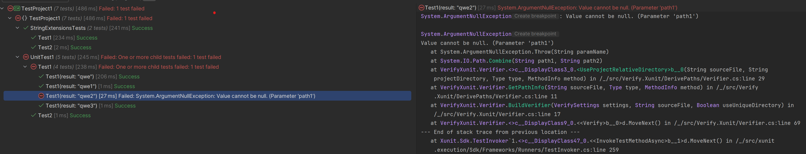

This repo demonstrates the issue with Verify package v28.14.1 (testes up until v28.16.0). The tests fail randomly (about 50% of attempts) as shown in screen:

The problem occurs when tests are executed both from IDE (Rider) od from CLI (`dotnet test`).